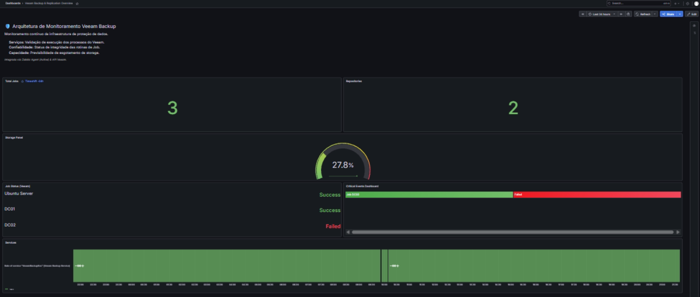

# Disaster Recovery e Observabilidade: Veeam Backup, Zabbix e Grafana

## Visao Geral

Este projeto documenta a implementação da camada de proteção de dados e resiliencia do Home Lab. O foco principal foi criar rotinas de backup robustas, garantir o Disaster Recovery de servicos criticos e integrar toda a operacao ao sistema de monitoramento (Zabbix/Grafana) atraves de templates customizados.

## Arquitetura do Ambiente Atual

* Servidor de Backup: Veeam Backup & Replication Community Edition.
* Domain Controllers: DC01 e DC02 (Ambiente Hibrido).
* Monitoramento: Zabbix Server e Grafana (Ubuntu).
* Seguranca de Borda: pfSense Firewall.
* Fisico: Maquina Host (Bare Metal Backup).

## Desafios e Solucoes

1. Monitoramento Integrado: Desenvolvimento de templates customizados no Zabbix para ler metricas do Veeam via API/Logs.
2. Dashboard Centralizado: Painel no Grafana para exibir status dos Jobs, taxa de transferencia e capacidade de Storage.
3. Disaster Recovery na Pratica (PoC): Simulacao de perda total do Domain Controller (DC02) e restauracao completa via Veeam, validando a sincronizacao do Azure AD Connect pos-incidente.

## Estrutura do Repositorio

* /architecture/: Documentacao de IPs, servidores e repositorio de storage.
* /diagramas/: Topologia da rede e fluxo de dados de backup.
* /docs/: Procedimentos Operacionais Padrao (SOP), incluindo o passo a passo do Restore.
* /images/: Evidencias visuais e prints da execucao dos jobs.
* /monitoring/: Dashboard do Grafana (.json) e template do Zabbix (.xml).
* /scripts/: Scripts em PowerShell para automacao e validacao de servicos.
* /troubleshooting/: Relatorios de analise de falhas e correcoes aplicadas.
* /validation/: Logs de sucesso e evidencias da Prova de Conceito (PoC).

## Roadmap do Home Lab (Proximos Passos)

- [x] Finalizar Veeam Backup & Replication (Fase Atual)
- [ ] Implementar TrueNAS (Storage + iSCSI)
- [ ] Configurar Windows Failover Cluster
- [ ] Implantar Hyper-V Cluster
- [ ] Configurar Active Directory Certificate Services (PKI)
- [ ] Implementar DFS Namespace + DFS Replication
- [ ] Integrar Microsoft Defender for Endpoint/Identity
- [ ] Expandir Azure Infrastructure
- [ ] Migracao/Testes com VMware ESXi + vCenter
- [ ] Automacao avancada de rotinas com PowerShell

## Referencias Visuais

Exemplo de visualizacao do ambiente (Dashboard do Grafana):

